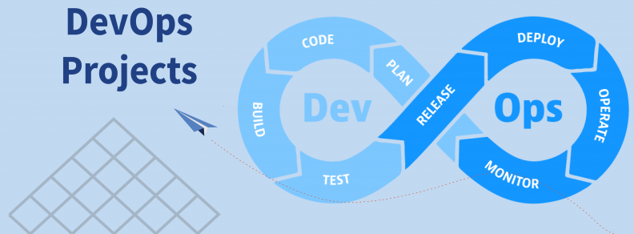
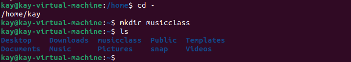
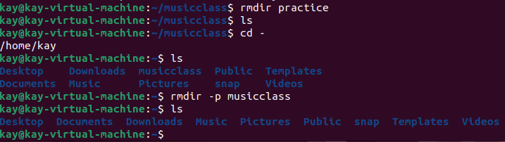

# Linux Project for Commands

## *I will be working on Linux Commands for this Project.* 

## File Manipulation

### `Sudo` Command: This means superuser do, sudo is one of the most popular basic linux commands that lets you to perform tasks that require administrative or root permissions.
        

### `pwd` command: This is used to find the path of the current/present working directory

### `cd` command: This is used to navigate through the Linux files and directories

### `ls` command: this is used to list files and directories within a system.There are many parameters that can be used with ls.

### `mkdir` command: this is used to create one or multiple directories at once and set permissions for each of them. for example, i created a directory "musicclass" and i opened a folder "practice" in it. See image below

### `rmdir` command: This is used to permantenly delete an empty directory, remember that the user for this command must have a sudo priviledge in the parent directory.  The created "practice folder' and "musicclass" were deleted. See Image below

### `df` command: This is used to report the system disk space usage showing in percentage and kilobyte

### `du` command: This is used to check space a directory or fil takes up, its also help to identify which part of the system uses the storage excessively

### `wget` command: This is used to downloads files from the internet using the wget command. It works in the background without hindering other running processes

### `ping` command: This is one of the most used basic Linux commands for checking whether a network or a server is reachable. its used to troubleshoot various connectivity issues.

