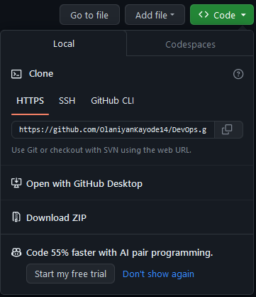

# Git Project

## Initializing a git Repository

Git has been installed on my system and a terminal (gitbash) was opened, in this terminal a working folder was created (KayDevOps) using the command `mkdir KayDevOps`, after then I changed my working folder into a directory (KayDevOps) using the command `cd KayDevOps`, when inside the folder, I did `git init`, as seen below

## Making the first commit

After we have created a working directory and initialzed it in a git repository, now we will make our first commit. In this section, wwe will create a file index.txt using the command `touch index.txt`, then `echo` the choice of sentence, then save it. we will then add the changes to git staging area using `git add .` then we commit your changes to git using `git commit -m "initial commit"`.

## Working with Branches

Git branch helps to create a different copy of your source code, In the new branch you can make chnages as you please and is independent of what is available in the main copy. This is commonly used to develop new features of your application. to create a new branch, i used `git checkout -b master`, as seen below

then I swiched back to the main branch as seen below

I also merged the two branches , so the content of master and main is merged. see image below

Deleting a branch. 

When new features is added to an application, it is often done in a feature branch. When it has been merged, it is usually deleted. using the code `git branch -d <branch_name>`

## Collaborations and Remote Repositories

Create a github account 

Created a repository on github (DevOps),  and pushed the local git repository to the remote github repository and did a clone. 

`git remote add origin <link to your github repo>`

`git clone <link to your remote repository>` See below

and did push to remote repository

Merged the repository, and updated the remote repository `https://github.com/OlaniyanKayode14/DevOps/tree/main/PROJECT2`, as seen below

